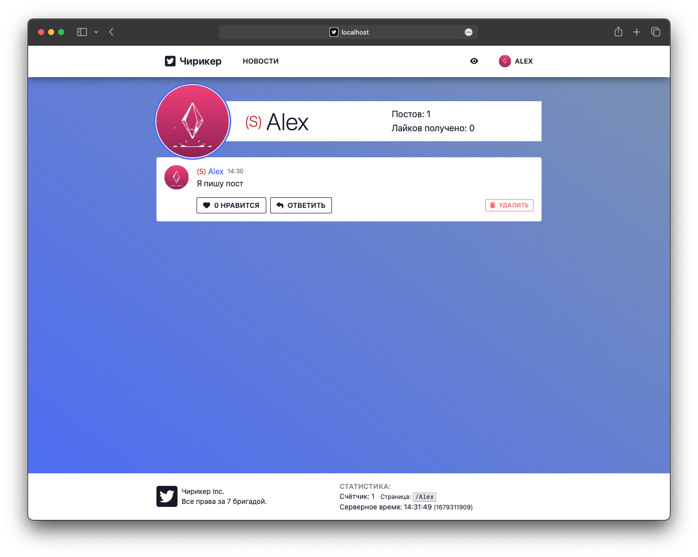

# Tweeter aka Чирикер

A small project I've made in 2 or 3 days and it turned out looking good so I decided to publish it.

UI is in russian because it was made as a university assignment.

_The code is awful tho_ (no refactoring is planned)

## Content

- [Main page](#main-page)
- [Register page](#register)
  - [With error](#with-error)
- [Posting stuff](#posting-stuff)
- [Admin page](#admin-page)
- [News page](#news-page)
- [Profile page](#profile-page)

## Some screenshots

### Main page

### Register page

#### With error

### Posting stuff

### Admin page

You can post news as a mod, change roles of other users.

### News page

### Profile page

